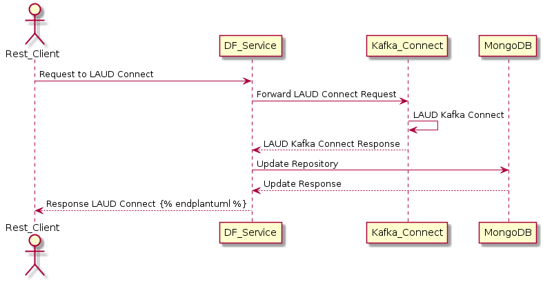
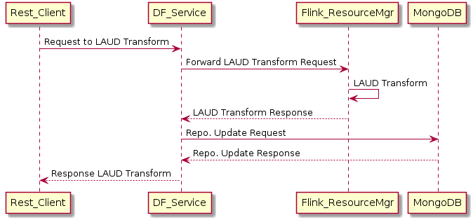
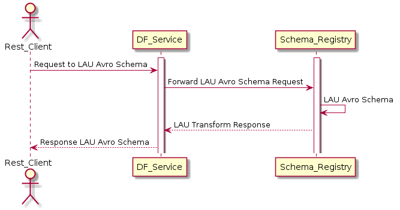
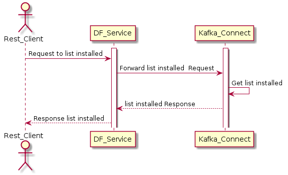
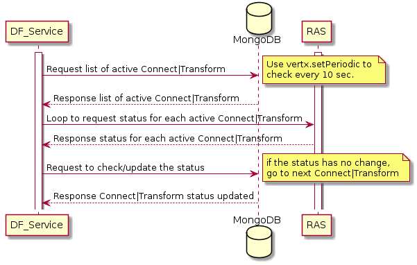
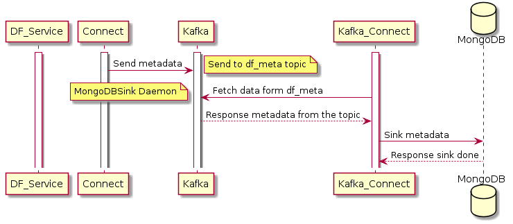
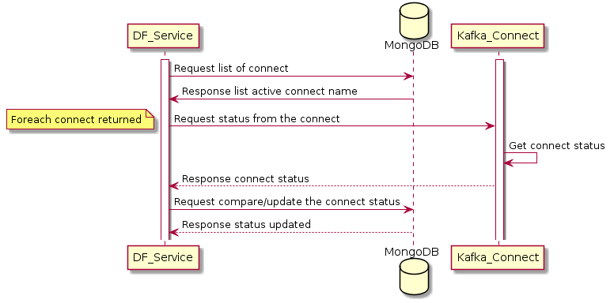
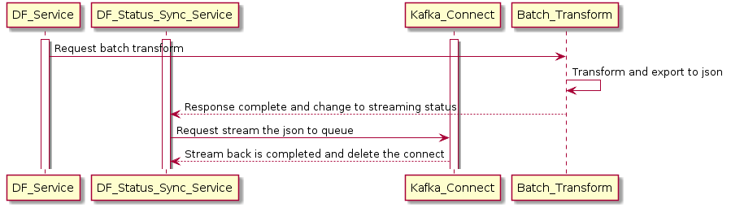

# Architecture Design

DataFibers application supports operations, such as _**L**_ist, _**A**_dd, _**U**_pdate, and _**D**_elete operations, on DF Connects or Transforms. In short, we call it **LAUD** operation. Below are DataFibers sequence diagram for common LAUD operations.

* Connect LAUD: Sequence for connect operations.
* Transform LAUD: Sequence for transform operations.
* Schema Registry LAU: Sequence for schema operations. 
* Installed L: Sequence for list of installed connects/transforms.
* Status Sync.: Sequence for synchronizing status.
* Stream Back: Sequence to stream back the batch result to queue.

## Connect LAUD

The Connect performs LAUD operation as follows.



```text
@startuml
activate DF_Service
database MongoDB
activate RAS

DF_Service -> MongoDB : Request list of active Connect|Transform
note right: Use vertx.setPeriodic to \ncheck every 10 sec.
DF_Service <-- MongoDB : Response list of active Connect|Transform
DF_Service -> RAS: Loop to request status for each active Connect|Transform
RAS --> DF_Service : Response status for each active Connect|Transform
MongoDB <- DF_Service : Request to check/update the status
note right: if the status has no change, \ngo to next Connect|Transform
MongoDB --> DF_Service : Response Connect|Transform status updated
@enduml
```

## Transform LAUD

The Connect performs LAUD operation as follows.



```text
@startuml
actor Rest_Client

activate DF_Service
database MongoDB
activate Kafka_Connect

Rest_Client -> DF_Service : Request to LAUD Connect
DF_Service -> Kafka_Connect : Forward LAUD Connect Request
Kafka_Connect -> Kafka_Connect : LAUD Kafka Connect
DF_Service <-- Kafka_Connect : LAUD Kafka Connect Response
DF_Service  -> MongoDB: Update Repository
MongoDB --> DF_Service: Update Response
Rest_Client <-- DF_Service : Response LAUD Connect
@enduml
```

## Schema Registry LAU

Schema registry is only support _**list**_, _**add**_, and _**update**_ operations because of Confluent API limitation.



```text
@startuml
actor Rest_Client
activate DF_Service
activate Schema_Registry

Rest_Client -> DF_Service : Request to LAU Avro Schema 
DF_Service -> Schema_Registry : Forward LAU Avro Schema Request
Schema_Registry -> Schema_Registry : LAU Avro Schema
DF_Service <-- Schema_Registry: LAU Transform Response
Rest_Client <-- DF_Service : Response LAU Avro Schema
@enduml
```

## Install L

Installed connect or transform view only supports a read-only _**list**_ operation as follows.



```text
actor Rest_Client
activate DF_Service
activate Kafka_Connect

Rest_Client -> DF_Service : Request to list installed 
DF_Service -> Kafka_Connect : Forward list installed  Request
Kafka_Connect -> Kafka_Connect : Get list installed 
DF_Service <-- Kafka_Connect: list installed Response
Rest_Client <-- DF_Service : Response list installed 
```

## Status Sync.

There are following functions to get status update regularly.



```text
activate DF_Service
database MongoDB
activate RAS

DF_Service -> MongoDB : Request list of active Connect|Transform
note right: Use vertx.setPeriodic to \ncheck every 10 sec.
DF_Service <-- MongoDB : Response list of active Connect|Transform
DF_Service -> RAS: Loop to request status for each active Connect|Transform
RAS --> DF_Service : Response status for each active Connect|Transform
MongoDB <- DF_Service : Request to check/update the status
note right: if the status has no change, \ngo to next Connect|Transform
MongoDB --> DF_Service : Response Connect|Transform status updated
```

### Connect\|Transform Sync.

DataFibers application launches a background daemon for regular synchronizing the connect/transform status in the repository \(MongoDB\) against Kafka/Flink **R**est **A**pi **S**ervices \(RAS\).

### Metadata Sync.

DataFibers application does not involve into the metadata, which keeps track of files processed by connects or transforms, synchronize path directly. For instead, it creates the metadata schema, and then launches the MongoDBSink to ship data into repository.



```text
activate Connect
activate Kafka
activate Kafka_Connect
database MongoDB

Connect -> Kafka: Send metadata
note right: Send to df_meta topic
Kafka <- Kafka_Connect : Fetch data form df_meta
note left: MongoDBSink Daemon
Kafka --> Kafka_Connect : Response metadata from the topic
Kafka_Connect -> MongoDB: Sink metadata
Kafka_Connect <-- MongoDB: Response sink done
```

### Startup Sync.

When DF starts, it first imports all available connect from repository and synchronize their status with Kafka connect.

>  We do not create start-up synchronize for transforms since we are not able to rebuilt the task configurations if we import the active transforms from Flink.



```text
activate DF_Service
database MongoDB
activate Kafka_Connect

DF_Service -> MongoDB: Request list of connect
DF_Service <- MongoDB : Response list active connect name
DF_Service -> Kafka_Connect : Request status from the connect
note left: Foreach connect returned
Kafka_Connect -> Kafka_Connect: Get connect status 
DF_Service <-- Kafka_Connect: Response connect status
DF_Service -> MongoDB: Request compare/update the connect status
DF_Service <-- MongoDB : Response status updated
```

## Stream Back.

When batch processing is complete, DF supports to stream back the result set to the queue for further consuming or transformation. It first exports the result set to a Json file. Then, it leverages file connector to send the file content to the queue when df status sync. daemon detects the batch file export is done. Once succeeded, the stream back connector will be deleted.



```text
activate DF_Service
activate DF_Status_Sync_Service
activate Kafka_Connect

DF_Service -> Batch_Transform : Request batch transform
Batch_Transform -> Batch_Transform: Transform and export to json 
DF_Status_Sync_Service <-- Batch_Transform: Response complete and change to streaming status
DF_Status_Sync_Service -> Kafka_Connect: Request stream the json to queue
DF_Status_Sync_Service <-- Kafka_Connect : Stream back is completed and delete the connect
```

