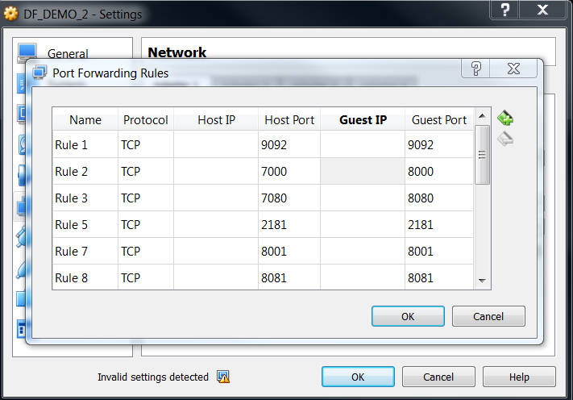

# Contributors and Developers
## Know More About Us
* Get to know about the project at [datafibers.com](http://datafibers.com/) | [datafibers.org](http://datafibers.org/)
* Watch and Star us in [DataFibers Community GitHub](https://github.com/datafibers-community)

* Fork and Pull Request when you are ready to contribute
* Contact Us for participant at [datafibers@gmail.com](mailto:datafibers@gmail.com)
* Join our discussion and ask questions at [datafibers@googlegroups.com](mailto:datafibers@googlegroups.com)
* Chat live with us at [DF Gitter](https://gitter.im/datafibers/df?utm_source=badge&utm_medium=badge&utm_campaign=pr-badge)
* Hear our news and events @ [Facebook](http://www.facebook.com/data.fibers) or [Twitter](http://twitter.com/datafibers1) or Wechat account **DataFibers Community**
* Our Meetup is incoming

## GitHub Repositories
* [df_data_service](https://github.com/datafibers-community/df_data_service) - This is core DataFibers services
* [df_demo](https://github.com/datafibers-community/df_demo) - This is where we build demo for DataFibers and other tookit
* [df_complete_guide](https://github.com/datafibers-community/df_complete_guide) - This is the source for this book
* [df_certified_connects](https://github.com/datafibers-community/df_certified_connects) - This is where we keep the connects self made or certified for DataFibers
* [df_api_doc](https://github.com/datafibers-community/df_api_doc) - This is script for rest api document generator as well as latest document backup
* [df_doc](https://github.com/datafibers-community/df_doc) - This is where we keep materials for rugular meetup and trainings

## Project Management
DataFibers' issues and kanban borad are two very important tools we are using for DataFibers management and delivery.
* [Issue List](https://github.com/datafibers-community/df_data_service/issues) - This is where we log all backlog items
* [Kanban Board](https://github.com/orgs/datafibers-community/projects/1?fullscreen=true) - This is where we manage and track the progress of work items.

> Do not forget to assign the issues under your name once you start working on it.
>

## How to Contribute
* Fork DF master branch to your own repository.
* Switch to the latest branch.
* Work on the code with your preferred Java IDE.
* Once done, checkin your code changes to your own GitHub repository.
* Create a branch pull request from **your_github_repo.development_YYYYMM** to **df_github_repo.development_YYYYMM**.
* Do proper code merge and changes until you can successfully send the pull request.
* The other DataFibers developers will review, comment, and approve your pull request and merge to **df_github_repo.development_YYYYMM**.
* At the end of every month, release team will merge the monthly development branch to the master having changes from all pulled. All issues related in the [Kanban Board](https://github.com/orgs/datafibers-community/projects/1?fullscreen=true) at ***Done & To Be Merged*** area will be closed and removed from the Kanban.
* Then, a new branch will be created for the next month as active development branch.

## How to Debug
There are generally two ways to debug in DF applications
### Server Debug
Server debug is to run server application in debug mode. In this case, we still keep DF dependecy environment, such as Kafka, running inside of VirtualBox, but to run the DF Data Service as server in debug mode outside of VirtualBox.

In order to make this work, we'll need to reforward DF appliation related port, such as 8000 (for UI) and 8080 (for REST Service) to other port number, such as 8000 to 7000, to make it avaliable for the DF application outside of VirtualBox as follows.

Also, make sure all of the DF dependecy application, such as Kafka, ZooKeeper, have their port forward outside of VirtualBox. Then, we can debug run the entrance function at DFInitService.main().

* Client Debug: Run client application in debug mode.