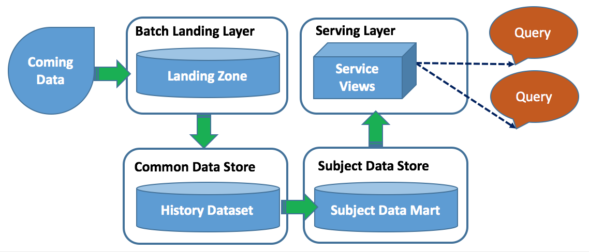
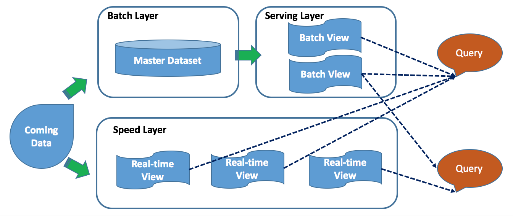
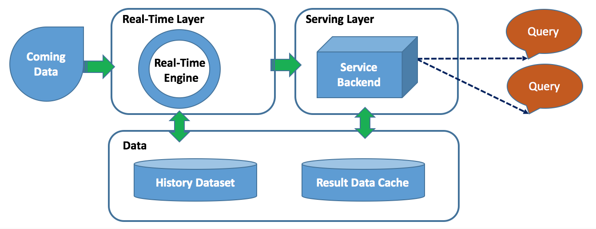
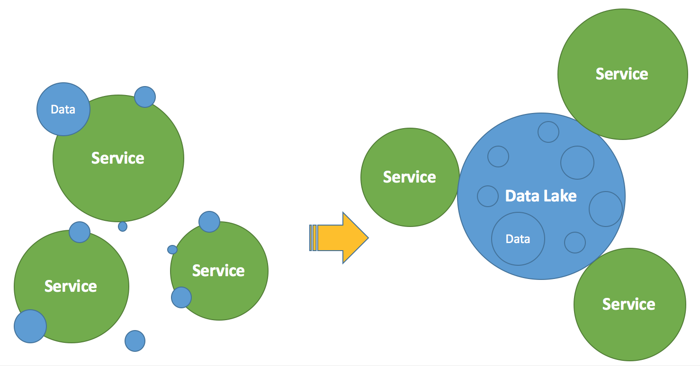

# History

There is a flood of interest in learning how to processing data in large-scale systems in terms of extract, transform, load in real time, partly because there are situations in which the time-value of data makes real-time analytic so attractive and important.

But gathering in-the-moment insights with complex data processing on the fly is extremely difficult. Although there are available big data framework or applications available to such use case, there are either too complex to use or incapable for a particular type of jobs. In addition, most time we need to combine both history data and real-time data together because history data accumulate values and asset for prediction and tuning the data in the fly. All of these requirements make existing big data framework alone, such as [Hadoop](http://hadoop.apache.org/), [Hive](http://hive.apache.org/), [Pig](http://pig.apache.org/), [Spark](http://spark.apache.org/), [Flink](https://flink.apache.org/), [Storm](https://storm.apache.org/), etc, not applicable well. Most companies start building in-house solutions to solve this technical issues. And, this is why it comes to the creation of DataFibers to provide a way ease of generic big data processing.

## Architecture

The big data processing architecture adapts to the speed and demanding for exploring values behind of the big data. The architectures of big data processing have three milestones during this evolution.

### Batch Processing Architecture

In the earlier period of big data processing, aka. Hadoop 1.0 era, most big data processing was based on MapReduce batch based jobs to process data from landing area to data mart layer. At that time, big data batch job gained attention over traditional data warehouse applications in terms of cost, stability, and performance, however, still keeps the similar processing design and pattern. At nowadays, batching processing is still playing an important role in most enterprises as transaction from legacy data processing framework.

   
 Figure 1.1 Hadoop MapReduce Based Batch Processing

### Hybrid Processing Architecture

When [IoT](https://en.wikipedia.org/wiki/Internet_of_things) becomes popular, there are quite a lot demanding on the speed of acquiring data. Apache Storm, Apache Spark, Flink, Kafka attracts more attention on their steaming data processing. However, more use cases are still using ad-hoc analytic queries on Hadoop batch processing, the single solution, awkward and frustrated. Lots demo or POC are started as separate streaming based big data processing system parallel running with batch processing system. What's more, [Lambda Architecture](https://en.wikipedia.org/wiki/Lambda_architecture) comes to the picture of big data processing for the very first time.

   
 Figure 1.2 Lambda Architecture for Hybrid Data Processing

The Lambda Architecture is designed to satisfy the needs for combined analysis on both history data, which is typically coming from batch processing \(batch layer\), and on-time data, which is ingested by data streaming \(speed layer\). This combined feature,which is served from serving layer, has wider use cases when data-driven business looking at the on-flying data for statistics and history data for decision making.

### Unified Processing Architecture

When there are lots of start-up coming into big data processing technology, they usually do not have burden like legacy system or history of data. Most of them jump directly into streaming processing especially for mobile related business or projects. Experienced gained when more people got used to streaming architecture and tentative to use the same processing architecture for batch data as well. In another saying, this comes to the unified big data processing architecture for various of type of big data processing, batch or stream. In addition, this is a pure streaming data processing architecture and reuse for batch processing as well. [Kappa Architecture](http://milinda.pathirage.org/kappa-architecture.com/) is one of very interesting and promising design by removing complex layers from Lambda Architecture - a Kappa Architecture is a simplification of Lambda Architecture. And, this is where DataFibers start from too.

   
 Figure 1.3 Kappa Architecture for Unified Processing

### To Conclude

Many companies have started or been staring evolving from pure batch to pure stream big data processing architecture. There are reasons arranged from legacy warehouse maintenance to technology maturity. Some company are still in the Batch or Lambda architectures. However, Lambda Architecture is [NOT recommended](https://www.oreilly.com/ideas/questioning-the-lambda-architecture) because of complexity and overhead, unless the company has very closed dependency on legacy data pipe and their big data architecture was already matured in the last three years. Kappa is where leading data company approaching.

## Methodology

### Data Oriented and Centric

Data-oriented design has actually been around for decades in one form or another. It gets special attention when big data era arrives. If we carefully exam the use cases around big data, we are not difficulty in finding out that any application is nothing without its data, data is all we have.

All the applications are all writing to output data, consuming input data, or sharing data among each others. The form of that data can be extremely complex, or so simple it requires no documentation at all, but all applications produce and need these data here or there. If the ultimate result of an application is data, and all input can be represented by data, and it is recognized that all data transforms are not performed in a vacuum, then a software development methodology can be founded on these principles, the principles of understanding and using the data makes a methodology called data-oriented and centric design.

   
 Figure 1.4 Data Oriented and Centric

### Data Application vs. Framework

There are fundamental differences between the roles of application and framework especially on big data domain. Framework libraries provide reusable services that encapsulate lower-level functionality in an abstraction that offers functionality with an easy to use API for higher level code within a variety of different applications. Currently, most open source big data technologies focus on the framework on top of generic use cases, such as Hadoop, Spark, etc.

With maturity of open source big data framework, open source big data application focusing on out-box use cases gains lots of attentions. We see big data applications, such as [Apache Kylin](http://kylin.apache.org/) and [Metron](http://metron.incubator.apache.org/), more popular on their ease of usage, ready for use cases.

At DataFibers, we believe open source big data will definitely go for flourish especially when we see more framework becomes mature and stable. Big data applications will leverage various of matured big data framework to speed up landing big data technology and innovations to business use cases.

### ETL For The Future

ETL stands for **E**xtract, **T**ransformation, and **L**oad. This is the most frequently used terms for data processing. Almost 80% of data warehousing and data analysis activities are about ETL. Therefore, ETL tools and methodology are very important for any type of data processing, especially on big data processing. There are three phase of ETL technologies in its evolution as follows.

#### ETL Centric Application

In this phase, ETL application is typical a central application server with multiple clients. ETL processing requires a dedicate cluster to firstly acquire data from external system, then perform transformation in the ETL cluster. At the end, the transformed data are loaded to the target. Since ETL tools are used to read or write with RDBMS quite often, "pushing down" the transformation logic to the RDBMS either to source or target are support quite often for better performance. This also comes to another terms after "**ETL**" as "**ELT**" by leveraging powerful computing resource in the RDBMS clusters.

#### ETL On Yarn/Docker

Distributed application, such as Apache Spark, Flink leverage distributed resource manageable framework, such as Yarn or Docker for running high performance but cost-effective distributed jobs. Right now, it is quite popular you migrate your traditional ETL jobs to Hive/Spark/Flink to do ETL.

#### ETL On Queue

Message queue is quite commonly used for landing real-time data to data lake/hub. Also, some message centric data architecture uses queue for data management as well as transformation. For example, Apache Kafka provides KSQL and KStream to perform ETL on Kafka. In addition, AWS Kinesis Analytics support SQL like on queue data transformation too.

