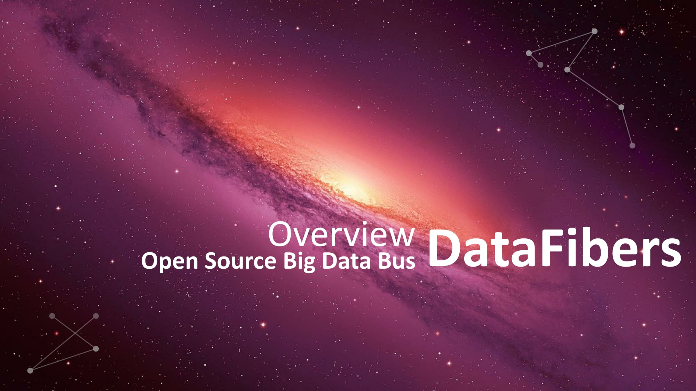

#DataFibers Overview

The complete slide is also availiable at [datafibers.com](http://www.datafibers.com)

The objective of DataFibers is to simplify big data processing, especially stream processing. 

DataFibers fully leverage the advantages of Apache Kafka's bus architecture for big data processing and sharing.

DataFibers application tackles the complexity and slowness in legacy big data processing architecture and framework.

